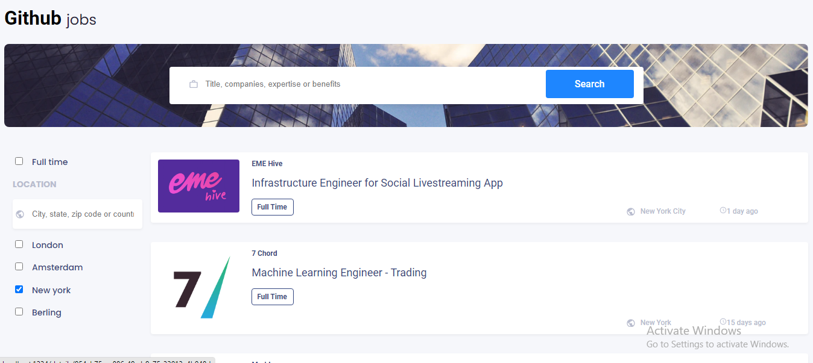
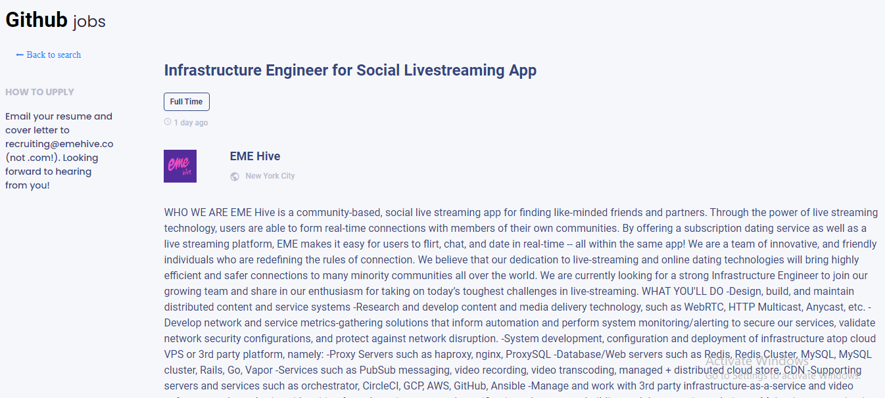

# Github Jobs

In this project the challenge was to create a job search using an API, and use React to handle the frontend. 

I also have to apply a few concept we learned in class, such as a **reducer** and a global **context**. And the  bonus was the **compound component**.


<h1 align="center">Github Jobs</h1>

<div align="center">
  <h3>
    <a href="https://github.com/Betsimisaraka/github-jobs">
      Demo
    </a>
    <span> | </span>
    <a href="https://github-jobs-anita.netlify.app/">
      Solution
    </a>
  </h3>
</div>

## Table of Contents

-   [Overview](#overview)
    -   [Built With](#built-with)
-   [Features](#features)
-   [How to use](#how-to-use)
-   [Contact](#contact)
-   [Acknowledgements](#acknowledgements)

<!-- OVERVIEW -->

## Overview

This is how my finish project look like.




-   Where can I see your demo?

You can see my demo in [Betsimisaraka](https://github.com/Betsimisaraka/github-jobs) Github
-   What was your experience?

My experiance was really good and useful with my project. Firstly, I fetch from the data from the API and display the data to the dom, then I did the pagination and the filtering.

-   In a few sentences, explain the structure of your project.

Firstly, I did this project with react including `Context` and `useReducer` together and there are few `useState` and `useEffect` as well also with `router`. I have completed this application with all of those things I mentioned above.

Scondly, there is an index.html file, index,js file which contains many children inside and style folder in which I put my styles. I did the style with scss. I also have some inline styles in some files which made by the styled-components dependency.

Thirdly, to make my code better and easy to read I shared the project into two components or folders: 

  1. The first one is pages component. This components have five files in it. Those five files are App.js, githubJobs.js, GithubJobsContext.js, GithubJobsDetails.js and style.js. These files are the main focus in this application. 

  2. And the second one is the components folder which cover all the files such as header, footer and etc, inside of this folder also I displaied the github jobs by mapping through the data.   

-   If you had more time, what area of your project would you improve?

If I had more time I would have improved my filter in the form input because I didn't manage to finish that.
Also I would have done the compound components section because I didn 't finish that one two. Lastly, I would have done a better css style with my project.

-   Did you learn anything new while working on this project?

Definetly, I have never known pagination before but with this project I did pagination and it work fine. Also fetching with usereduser was quite new for me but I made it work.

-   What was the most challenging part for you?

Fetching the API with useReducer was quite challenging part for me because We haven't done many of them before. Not only that but also the pagination part was a bit difficult as well.

-   Any other comments?


### Built With

<!-- This section should list any major frameworks that you built your project using. Here are a few examples.-->

-   [React](https://reactjs.org/)
-   [Sass]()
-   [Html]()

## Features

These are the user stories that we had to fulfilled:

- I can see a list of jobs in a city by default
- I can search for jobs with a given keyword
- I can search for jobs with a city name, zip code or other location
- I can select one option from at least 4 pre-defined options
- I can search for a full-time job only
- I can see a list of jobs with their logo, company name, location, and posted time.
- When I select a job, I can see job descriptions and how to apply like the given design.
- When I am on the job details page, I can go back to the search page
- (optional): I can see a list of jobs in the closest city from my location by default
- (optional): I can see jobs in different pages, 5 items each page

## How To Use

<!-- Example: -->

To clone and run this application, you'll need [Git](https://git-scm.com) and [Node.js](https://nodejs.org/en/download/) (which comes with [npm](http://npmjs.com)) installed on your computer. From your command line:

```bash
# Clone this repository
$ git clone https://github.com/Betsimisaraka/github-jobs

# Install dependencies
$ npm install react react-dom react-router-dom styled-components date-fns react-paginate

# Run the app
$ parcel index.html
$ npm start
```

## Acknowledgements

<!-- This section should list any articles or add-ons/plugins that helps you to complete the project. This is optional but it will help you in the future. For example: -->

## Contact

-   Website [your-website.com](https://{your-web-site-link})
-   GitHub [Betsimisaraka](https://github.com/Betsimisaraka/github-jobs)
